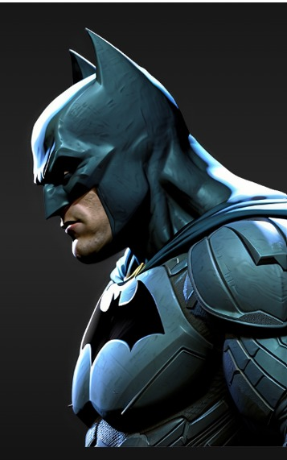

<!DOCTYPE html>
<html lang="es">

<head>

<meta charset="UTF-8">
<meta name="viewport" content="width=device-width, initial-scale=1.0">

<title>Feliz Cumpleaños 🦇</title>

</head>

<body>

<!-- TARJETA INICIAL -->

    <h1>🎁 Sorpresa</h1>

    

        Tengo algo especial para ti...
    

    <button onclick="mostrarVideo()">

        Presiona aquí 💛

    </button>

<!-- IMAGEN IZQUIERDA -->

<!-- IMAGEN DERECHA -->

<!-- MURCIÉLAGOS -->

🦇

🦇

🦇

🦇

<!-- DESTELLOS -->

✦

✦

<!-- VIDEO -->

    <video controls>

        <source
            src="cumple.mp4"
            type="video/mp4"
        >

        Tu navegador no puede reproducir este video.

    </video>

    

        Feliz Cumpleaños Mi Duende Hermosa 💜😛

    

</body>

</html>
